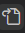
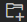
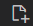
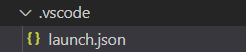

# Visual Studio CodeでFortranを書く環境を整える
## Visual Studio Codeのインストール
[Visual Studio Code の公式ページ](https://code.visualstudio.com/)へアクセスし**Download for Windows**を押す．  
ダウンロードされた**VSCodeSetup-x64-x.xx.x.exe**を実行する．  
以下Visual Studio CodeをVSCodeと表記する．
## 拡張機能のインストール
Fortran には万能な拡張機能が存在しないため，いくつかの拡張機能をインストールする必要がある．
拡張機能のインストールは画面左の


のアイコンをクリックもしくはCtrl+Shift+Xを押す．  
以下に示す5つの拡張機能をインストールする．

### Japanese Language Pack for Visual Studio Code
- VSCode の日本語化
### C/C++
- デバッグ時に使用
### FORTRAN Intellisence
- language-serverの利用
- コードナビゲーション
### Modern Fortran
- Syntax highlight
- snippets
- lint
### Fortran breakpoint Support
- ブレークポイントの設定

## Pythonのインストール
[python公式サイト](https://www.python.org/)にアクセスし，**Downloads**から**Windows**を選択し，**Stable Releases**の一番上にあるバージョンから**Download Windows installer** \(64bit\)を選択する．ダウンロードが完了したら，インストーラを起動し，**install now**をクリックする．

> Windows installerは必ず64bitを選択すること

コマンドプロンプトもしくはpowershellを開き，
```bash
python -V
```
と入力しEnterを押す．

```bash
Python 3.x.x
```
と出力されればOK．

## 仮想環境の作成
fortranのlanguage-serverを使用するためにはpythonのモジュールをインストールする必要がある．  
しかし，fortranを書くとき以外はそのモジュールは必要ないため，別の環境を作成し，fortranを書くときのみその環境を使用することとする．  
コマンドプロンプト，もしくはPowershellで

```bash
pip install virtualenv
```
と入力しEnterを押す．  
virtualenvとは，仮想環境を作成するためのモジュールである．  
VSCodeを起動し，fortranのファイルがあるフォルダを開く．  
Ctrl+Shift+@ もしくは **ターミナル** から **新しいターミナル** を選択する．  
```bash
virtualenv .fortran
```
と入力してEnterを押し，エクスプローラーで **.fortran** が作成されたことを確認する．  
コマンドプロンプトでは
```bash
./.fortran/Scripts/activate.bat
```
Powershellでは
```bash
./.fortran/Scripts/activate.ps1
```
と入力してEnterを押す．


## pip を使用してlanguage-serverをインストール
```bash
(.fortran) PS C:\..>
```
左に`(.fortran)`と表示されていることを確認して以下の操作を実行する．
### fortls, fortran-language-server
```bash
pip install fortls fortran-language-server fprettify
```
インストールが完了したら以下のコマンドを実行
```bash
deactivate
```
左の`(.fortran)`が消えていることを確認する．

## settings.jsonに設定を追記する


左下の歯車のアイコンをクリックし，設定を開く．



設定画面の右上にあるアイコンをクリックする．  
settings.jsonに追記する．
```json
"fortran.formatting.formatter": "fprettify",
"fortran.formatting.fprettifyArgs": [
	"--indent",
	"4",
	"--enable-decl",
	"--strip-comments",
	"--case",
	"1",
	"1",
	"1",
	"1"
],
"fortran.linter.compiler": "gfortran",
"fortran.linter.compilerPath": "C:\\Pathto\\gfortran.exe",
"fortran.linter.extraArgs": [
	"-fdefault-real-8",
	"-Wunused-variable",
	"-Wunused-dummy-argument"
],
```

`C:\\Pathto\\gfortran.exe`の`Pathto`の部分は自身の環境でのgfortranがインストールされているフォルダへのフルパスに書き換える．

## ローカルでの settings.json の編集
`.vscode`という名前のサブフォルダを作成する．  
ターミナルを起動して以下のコマンドを実行．
```bash
mkdir .vscode
```
もしくは



のアイコンをクリックし`.vscode`と入力する．  
`.vscode`内で`settings.json`という名前のファイルを作成する．  
`settings.json`に以下のように記入．
```json
{
    "fortran-ls.executablePath": "C:\\{workspace}\\.fortran\\Scripts\\fortls.exe",
    "fortran.fortls.path": "C:\\{workspace}\\.fortran\\Scripts\\fortls.exe"
}
```
`{workspace}`はfortranを書くために今開いているフォルダへのパスに置き換えること．  

## Fortran ファイルの作成


のアイコンをクリックし，`main.f90`というファイルを作成する．
```f90
program main
    implicit none
    write(*, *) "Hello, world!"
end program main
```
上に示すコードを書いて保存し，ターミナルを立ち上げる．(Ctrl+Shift+@)  
```bash
gfortran main.f90 -o main
./main
```
エラーがなければ
```bash
Hello, world!
```
と表示される．

## デバッグ


`.vscode`フォルダに`launch.json`という名前のファイルを作成する．  
`launch.json`を開き，構成の追加 から C/C++: （gdb）起動 を選択する．  
```json
{
    "configurations": [
        {
            "name": "(gdb) 起動",
            "type": "cppdbg",
            "request": "launch",
            "program": "${workspaceFolder}/${fileBasenameNoExtension}.exe",
            "args": [],
            "stopAtEntry": false,
            "cwd": "${workspaceFolder}",
            "environment": [],
            "externalConsole": false,
            "MIMode": "gdb",
            "miDebuggerPath": "C:/Pathto/gdb.exe",
            "setupCommands": [
                {
                    "description": "gdb の再フォーマットを有効にする",
                    "text": "-enable-pretty-printing",
                    "ignoreFailures": true
                },
                {
                    "description":  "逆アセンブリ フレーバーを Intel に設定",
                    "text": "-gdb-set disassembly-flavor intel",
                    "ignoreFailures": true
                }
            ]
        }
    ]
}
```
`launch.json`を上記のように編集する．なお`gdb.exe`へのパスは適宜書き換えること．  
F5キーを押すとデバッグ コンソールが起動し，Hello, world!と出力されていれば成功．

## コンパイルの自動化
`tasks.json`を`.vscode`内に作成する．  
```json
{
    // See https://go.microsoft.com/fwlink/?LinkId=733558
    // for the documentation about the tasks.json format
    "version": "2.0.0",
    "tasks": [
        {
            "label": "build fortran",
            "type": "shell",
            "command": "gfortran",
            "args": [
                "-g",
                "${file}",
                "-o",
                "${fileBasenameNoExtension}",
            ]
        }
    ]
}
```
上記の通りに編集し，`launch.json`に以下の項目を追加する．
```json
"preLaunchTask": "build fortran",
```
F5キーで実行すると，コンパイルから実行までが自動で行われる．